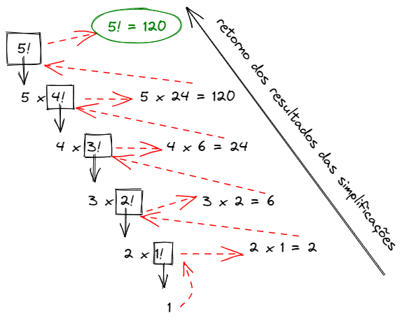

# Recursividade
📚 Minha visão sobre a técnica de recursividade na progamação

### Minha Definição:

Uma função recursiva é uma função que chama a si própia 🤝

### tipos de recursividade:
A função recursiva pode se auto chamar dentro do própio escopo. Esse tipo de método é chamado de **Recursividade direta**.
utilizando o exemplo de cálculo de fatorial, é possivel ver a recursividade direta na seguinte função:

~~~Python
  def fatorial(n):
    if n <= 1:
      return 1
    else:
      return n * fatorial(n-1)
~~~
###### codigo 1

Note que na estrutura de condição `else` da função `fatorial` é passada a própia função.

O outro tipo de função recursiva é a **recursividade indireta**, onde, a função recursiva é chamada a partir de outra função. Exemplo:
~~~Python
def exibir_fatorial(num):
  print(fatorial(num))
~~~
###### codigo 2
A função `exibir_fatorial` exibe na tela o resultado da função recursiva `fatorial`.

### Como a recursividade funciona?
 Primeiro é necessario saber que a recursividade faz a divisão do problema em duas partes:

 O **caso base** que é uma forma do problema que se da uma resposta direta.
~~~Python
def fatorial(n):
  #caso base
  if n<= 1:
    return 1
~~~

O **caso geral** que seria um caso mais completo, no entanto, não é a solução final.

<!-- o caso geral, seria os casos "dentro da recursividade"? -->
~~~Python
#caso base
if n<= 1:
  return 1
#recursao esta aqui:
else:
  return n * fatorial(n-1)
~~~

Considerando a lógica da definição do cálculo de fatórial, é possivel encontrar o caso base, os resultados de 1! e 0! que são iguais a 1. Sabendo disso, a função recursiva irá simplificar o cálculo do fatorial **como se fosse uma estrutura de repetição**. Irá chamar a si própia até simplificar o suficiente para chegar ao caso base. Observe a imagem:

Após chegar ao caso base, a função recursiva irá resolver os casos intermediários ate obter o resultado completo. Confira a imagem:

### Porque usar a recursividade ?
Como dito anteriormente, a recursividade funciona como se fosse uma estrutura de repetição. Algumas vezes a implementação recursiva pode ser "convertida" em iterativa. Veja esse exemplo da utilização da estrutura de repetição `while` na resolução do mesmo problema:
~~~Python
def fatorial(n):
    fatorial = 1
    i=n
    while(i>0):
        fatorial*=i
        i=i-1
    return fatorial

numero = int(input("digite um numero para saber seu fatorial: "))
print(fatorial(numero))
~~~

Muita das vezes a otimização de códigos é feita diminuindo a complexidade de seus algoritimos, neste caso, a recursividade substitui a complexidade dos laços para que haja mais perfomance de processamento e memória.

No entanto, códigos com recursividade são de difícil entendimento, assim causando dificuldades em manutenção de código. 

há casos onde a solução iterativa é difícil de se obter ou tem desempenho inferior à recursiva. Porém, sempre que possível deve-se optar por uma solução não recursiva.
